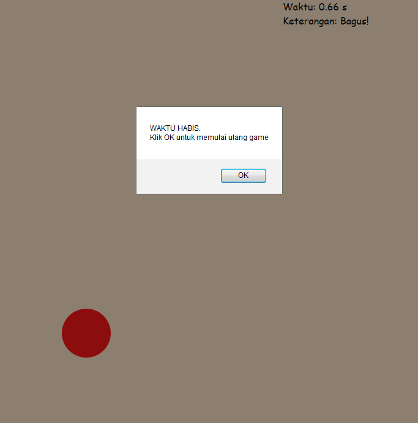

# Click Game
> :information_source: _This repo created only for study purpose_
## :round_pushpin:Table of contents
- _[About The Project](#about-the-project)_

## About The Project
**Repo ini dibuat untuk:**

- ...Belajar HTML dasar
- ...Belajar CSS dasar
- ...Belajar javascript dasar

**What the project does:**
- ...Simpel game, lingkaran tidak di klik anda kalah

**Dibuat menggunakan:**
- ...Notepad++
- ...HTML
- ...CSS
- ...Vanilla Javascript

**Links:** 
- _...See it live! <a href="https://xvferdy.github.io/click-game/" target="_blank">Here</a>_
- _...Similar project: <a href="https://codepen.io/xvferdy/pen/RdMdRP" target="_blank">Click Reaction</a>_

